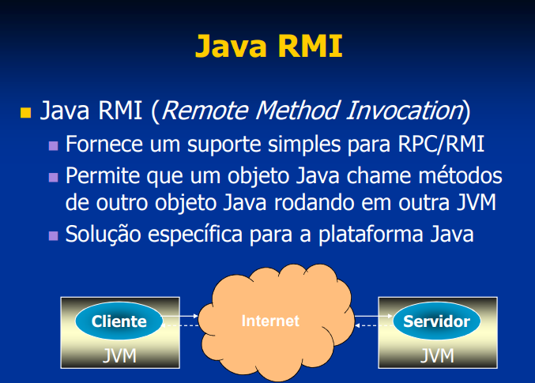

# Comunicação entre processo: Java RMI - permitem chamar procedimentos/métodos remotamente

# Atividade Prática
* Criar seu repositório no github em seu perfil com os programas;
* Compilar os programas "javac *.java";
* Executar o comando "rmic HelloServer";
* Executar o comando "rmiregistry &";
* Executar o programa "java HelloServer";
* Executar o programa "java HelloCliente localhost" (outra janela bash);
* Tirar os print de execução e realizar o upload no seu repositório;
* Enviar o link do seu repositório como resposta da atividade;